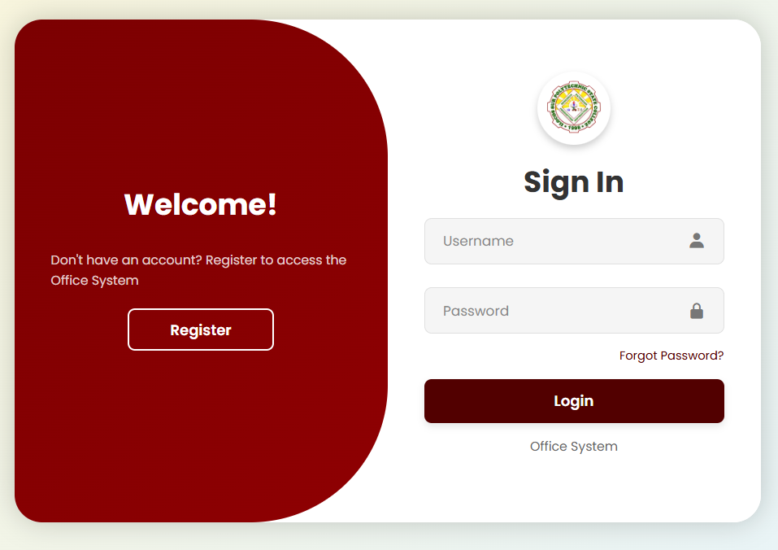

# ISPSC Supply Office Login 

A modern neumorphic login/registration interface for ISPSC Supply Office 

demo(https://bj0r.github.io/login/)

## Features
- **Sleek Neumorphic Design** - Soft UI shadows and smooth animations
- **Responsive Layout** - Works on all devices (mobile, tablet, desktop)
- **Enhanced Security**:
  - Password strength meter
  - CSRF token protection
- **Accessibility**:
  - ARIA labels for screen readers
  - Keyboard navigation support
- **Brand Customization**:
  - ISPSC color scheme
  - Institutional logo integration

## Installation
1. Clone this repository
2. Open `index.html` in any modern browser
3. No server requirements - works client-side only

## Attribution
This project modifies the original [Neumorphism Login Form](https://codepen.io/ricardoolivaalonso/pen/YzyaRPN) by [Ricardo Oliva Alonso](https://codepen.io/ricardoolivaalonso), used under MIT License.

### Key Modifications:
- Complete visual redesign with ISPSC branding
- Added password visibility toggle
- Implemented form validation
- Enhanced mobile responsiveness
- Added forgot password modal
- Improved accessibility features

## License
MIT License - See [LICENSE](LICENSE) file for details.

Copyright (c) 2025 BJ0R (modifications)
Copyright (c) 2025 Ricardo Oliva Alonso (original design)
